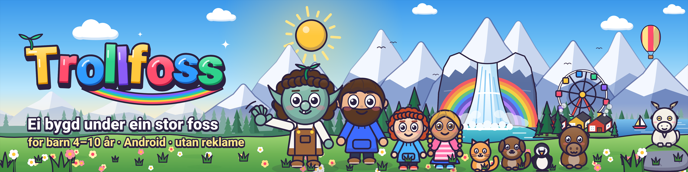
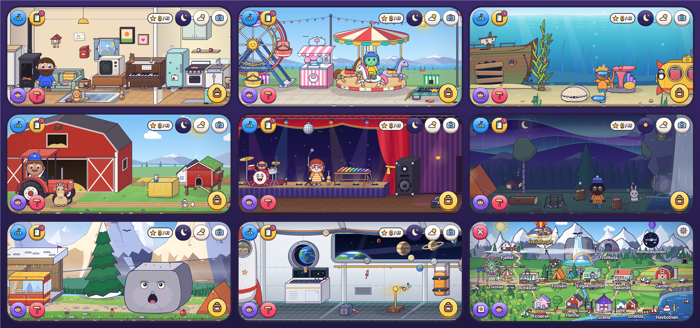
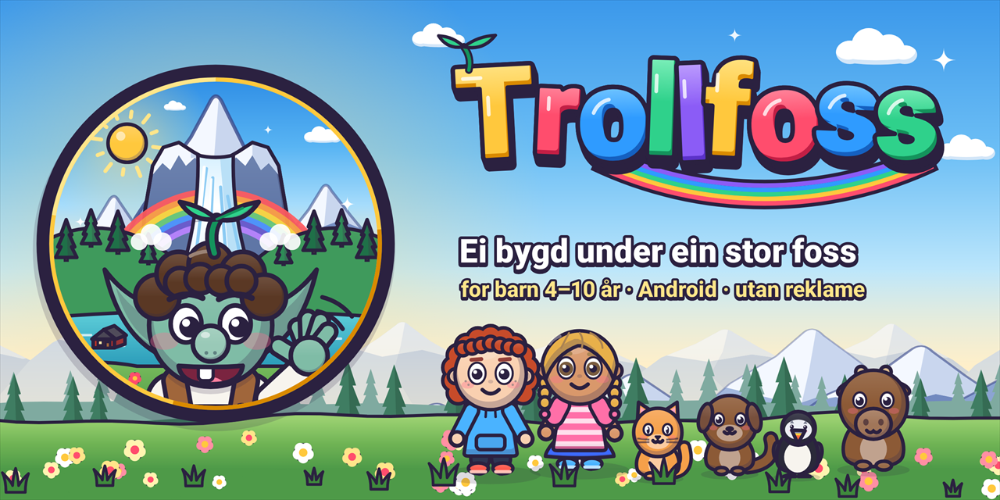

<p align="center"></p>

<p align="center">
  <a href="https://github.com/oyvhov/trollfoss-android/releases/latest"></a>
  
  
  
</p>

<h3 align="center">Eit digitalt dukkehus for barn frå 4 til 10 år<br />– ei heil bygd med folk, dyr og troll å leike med.</h3>

<p align="center"><a href="https://github.com/oyvhov/trollfoss-android/releases/latest"><b>⬇ LAST NED TROLLFOSS (APK)</b></a></p>

---

Ingen reglar, ingen poeng og ingenting å tape. Barnet flyttar figurar og ting rundt, finn på historier og
oppdagar kva som skjer når ting møtest. **Alt kan plukkast opp, kastast, givast til nokon eller puttast
i noko.** Og alt er levande: figurane pustar, blunkar, ønskjer seg ting, pratar saman, går tur, set seg,
og legg seg til å sove når natta kjem.

<p align="center"></p>

## 17 stader

| Stad | Det du kan gjere |
| --- | --- |
| **Heime** | Leggje nokon i senga, slå på radioen og danse, lage mat, bade, spyle ting ned i do. |
| **Bakeriet** | Bake kake av deig og eple, lage smoothie, hente is og frukt. |
| **Frisøren** | Klippe, krølle og farge håret, prøve nye klede og hattar. |
| **Stranda** | Fiske frå brygga, bade, byggje sandslott, ro båt. |
| **Fossen** | Telt, bål, marshmallow og eit drakeegg som klekkjer. Nordlys og stjerneskot om natta. |
| **Trollhola** | Trollgryta blandar to ting til noko nytt. Eliksirar som gjer figurane store, små eller svevande. |
| **Fjellet** | Akebakke, hoppbakke, snømann, badstu og ønskehol i isen. |
| **Garden** | Køyre traktor, snikre i verkstaden, dyrke gulrøter og hente egg. |
| **Romstasjonen** | Vektløyse, ekte planetar å leike med, og ein rakett som skyt opp. |
| **Tivoliet** | Pariserhjul, karusell, radiobilar, trampoline, sukkerspinn og boksbombing med premie. |
| **Butikken** | Skanne varer på samlebandet, vege alt og alle, trille handlevogna. |
| **Legekontoret** | Røntgen som viser skjelettet, stetoskop som finn hjarteslaget, plaster og medisin. |
| **Scena** | Trommer, xylofon og mikrofon – spel i band! Discokule og røykmaskin. |
| **Havbotnen** | Alt sym. Ubåt, kjempemusling med perle, skipsvrak og ein blekksprut med humor. |
| **Heileberget** | Det store, lange fjellet: ta taubana opp, rop mot ekko-steinen, møt geitene og plant flagget på toppen. |

## Det som gjer det spesielt

- **Humor overalt.** Prompepute, bananskal, pepar som bles hatten av, kake i fjeset, hikke og rap, kiling – og alle ler med.
- **Ønskjebobler.** Figurane tenkjer på noko dei vil ha. Gi dei det og sjå kva som skjer.
- **Heimedesignar.** Flytt møblar, hent nye frå katalogen, byt tapet og golv, legg møblar på lager. Kosten ryddar heile staden.
- **Oppdrag og klistremerke.** Tre biletoppdrag om gongen sender deg rundt i bygda. Klistremerka opnar spesialmøblar.
- **Figurverkstad.** Lag eigne figurar med hud, høgd, frisyre, klede og namn.
- **Skrå-3D.** Verda er teikna i skrå projeksjon med djupn, skuggar og lys som følgjer tida på døgnet.
- **73 løynde glimt**, ei oppdagingsbok med oppskrifter, dagens pakke i postkassa – og nokre **løynde overraskingar** som ikkje er nemnde her.
- **Dag og natt**, regn, snø, regnboge, nordlys. Kamera og fotoalbum.

<p align="center"></p>

## Installer på Android

1. Trykk **[Last ned APK](https://github.com/oyvhov/trollfoss-android/releases/latest)** på telefonen eller nettbrettet og vel fila `Trollfoss-v….apk`.
2. Opne fila. Dersom Android spør, tillat installasjon frå nettlesaren du brukte.
3. Vel **Installer** og opne Trollfoss.

Har du Trollfoss frå før? Installer oppå den gamle. **Ikkje avinstaller først** – då forsvinn figurane.

## Oppdateringar

Trollfoss ser sjølv etter nye versjonar på GitHub når appen blir opna, høgst éin gong per tolv timar. Ein
vaksen vel når oppdateringa skal lastast ned og installerast:

**Kart → tannhjulet → reknestykket → Appoppdateringar → Sjekk no**

Appen kontrollerer fila, versjonen og signaturen før Android får spørsmål om installasjon.

## Utan reklame og konto

Ingen reklame, sporing, kjøp eller konto. Alt blir lagra på eininga. Einaste nettkontakt er
oppdateringssjekken mot GitHub, som kan slåast av. **All grafikk, musikk og lyd er laga i kode** – ingen
opptak, ingen bilete, ingenting å lisensiere.

## Lisens\n\nTrollfoss er **ikkje open kjeldekode**. Du kan lese koden, installere appen og bruke han privat med barna dine,\nmen ikkje kopiere, endre, dele vidare eller bruke kode, bilete, musikk, namn eller figurar i noko anna utan\nskriftleg løyve. Sjå [LICENSE](LICENSE).\n\n[Meld ein feil](https://github.com/oyvhov/trollfoss-android/issues) · [Endringslogg](CHANGELOG.md) · [Designunderlag](docs/DESIGN.md)

<details>
<summary>For utviklarar</summary>

Kotlin og Jetpack Compose, `minSdk 26`. Spelmotoren er skriven frå botnen: fysikk med djupn i skrå-3D,
biletbuffer for stille møblar og ting, synteserte lydar og musikk. Les
[arbeidsrettleiinga](docs/AI_INSTRUCTIONS.md), [teiknereglane](docs/ART_GUIDE.md) og
[releaseoppskrifta](docs/RELEASE_WORKFLOW.md).

```powershell
powershell -NoProfile -ExecutionPolicy Bypass -File scripts\Build-Trollfoss.ps1          # testar og byggjer debug
powershell -NoProfile -ExecutionPolicy Bypass -File scripts\Build-Trollfoss.ps1 -Release # signert APK
powershell -NoProfile -ExecutionPolicy Bypass -File scripts\Start-TrollfossTablet.ps1    # nettbrettemulator
```

Ein release-APK krev `signing.properties` og `.signing/trollfoss-release.jks`. Dei ligg berre på
utviklarmaskina og er Git-ignorerte; nøkkelen må aldri lagast på nytt, for då kan ikkje appen oppdaterast.

</details>
