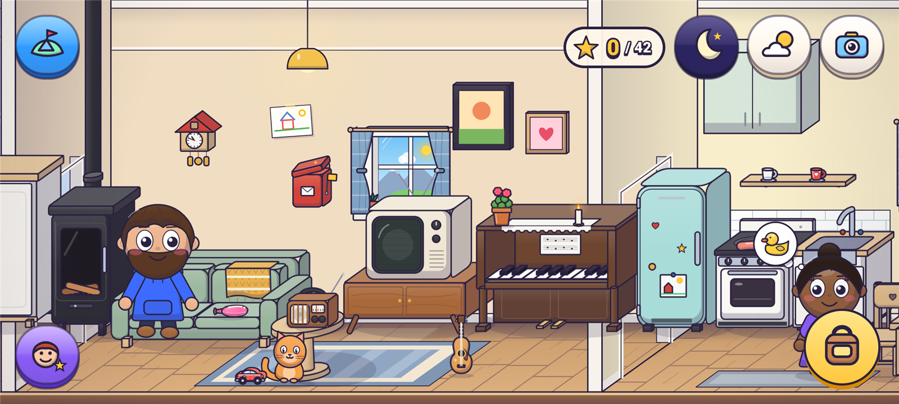

<p align="center"></p>

<h1 align="center">Trollfoss</h1>

<p align="center"><strong>Ei lita bygd under ein stor foss, der folk, dyr og troll bur saman.</strong><br />
Eit digitalt dukkehus for barn frå 4 til 10 år · Android 8.0 eller nyare · mobil og nettbrett (liggjande)</p>

<p align="center"><a href="https://github.com/oyvhov/trollfoss-android/releases/download/v1.0.0/Trollfoss-v1.0.0.apk"><strong>⬇ LAST NED TROLLFOSS 1.0.0 — APK</strong></a><br />
<a href="https://github.com/oyvhov/trollfoss-android/releases/latest">Nyaste release</a></p>

## Kva er Trollfoss?

Ingen reglar, ingen poeng og ingenting å tape. Barnet flyttar figurar og ting rundt, finn på historier
og oppdagar kva som skjer når ting møtest. Alt kan plukkast opp, kastast, givast til nokon eller
puttast i noko.

  Stad   Det du kan gjere  
  ---   ---  
  **Heime**   Leggje nokon i senga, slå på radioen og danse, lage mat, bade, spyle ting ned i do.  
  **Bakeriet**   Bake kake av deig og eple, lage smoothie, hente is og frukt.  
  **Frisøren**   Klippe, krølle og farge håret, prøve nye klede og hattar.  
  **Stranda**   Fiske frå brygga, bade, byggje sandslott, ro båt.  
  **Fossen**   Telt, bål, marshmallow og eit drakeegg som klekkjer. Nordlys om natta.  
  **Trollhola**   Trollgryta blandar to ting til noko nytt. Eliksirar som gjer figurane store, små eller svevande.  
  **Fjellet**   Akebakke, hoppbakke, snømann, badstu og ønskehol i isen.  
  **Garden**   Køyre traktor, snikre i verkstaden, dyrke gulrøter og hente egg.  
  **Romstasjonen**   Vektløyse, ekte planetar å leike med, og ein rakett som skyt opp.  

- **Figurverkstaden**: lag eigne figurar med hud, høgd, frisyre, klede og namn.
- **27 løynde glimt**, ei **oppdagingsbok** med oppskrifter og **dagens pakke** i postkassa.
- **Dag og natt**, regn, snø og regnboge. Kamera og fotoalbum.

## Installer på Android

1. Trykk **[Last ned APK](https://github.com/oyvhov/trollfoss-android/releases/download/v1.0.0/Trollfoss-v1.0.0.apk)** på telefonen eller nettbrettet.
2. Opne fila. Dersom Android spør, tillat installasjon frå nettlesaren du brukte.
3. Vel **Installer** og opne Trollfoss.

Har du Trollfoss frå før? Installer oppå den gamle. **Ikkje avinstaller først** – då forsvinn figurane.

## Oppdateringar

Trollfoss ser sjølv etter nye versjonar på GitHub når appen blir opna, høgst to gonger om dagen. Ein
vaksen vel når oppdateringa skal lastast ned og installerast:

**Kart → tannhjulet → reknestykket → Appoppdateringar → Sjekk no**

Appen kontrollerer fila, versjonen og signaturen før Android får spørsmål om installasjon.

## Utan reklame og konto

Ingen reklame, sporing, kjøp eller konto. Alt blir lagra på eininga. Einaste nettkontakt er
oppdateringssjekken mot GitHub, som kan slåast av. All grafikk, musikk og lyd er laga i kode.

[Meld ein feil](https://github.com/oyvhov/trollfoss-android/issues) · [Endringslogg](CHANGELOG.md) · [Designunderlag](docs/DESIGN.md)

<details>
<summary>For utviklarar</summary>

Kotlin og Jetpack Compose. Les [arbeidsrettleiinga](docs/AI_INSTRUCTIONS.md),
[teiknereglane](docs/ART_GUIDE.md) og [releaseoppskrifta](docs/RELEASE_WORKFLOW.md).

```powershell
powershell -NoProfile -ExecutionPolicy Bypass -File C:\topa\scripts\Build-Trollfoss.ps1 -Release
```

</details>
